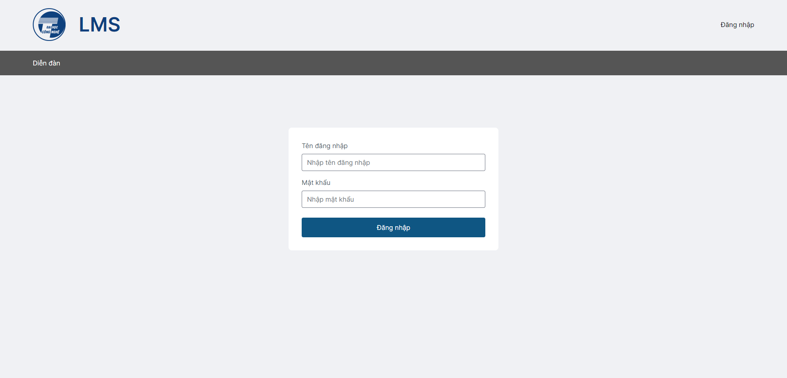
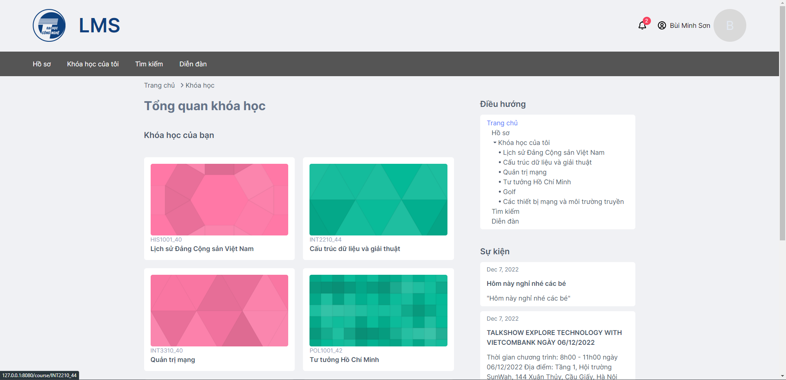
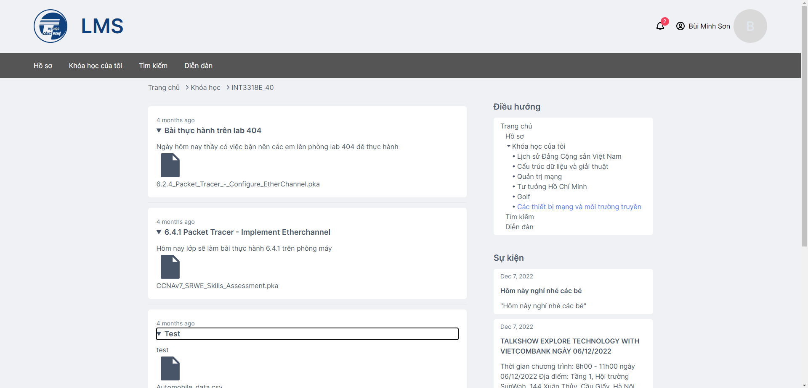
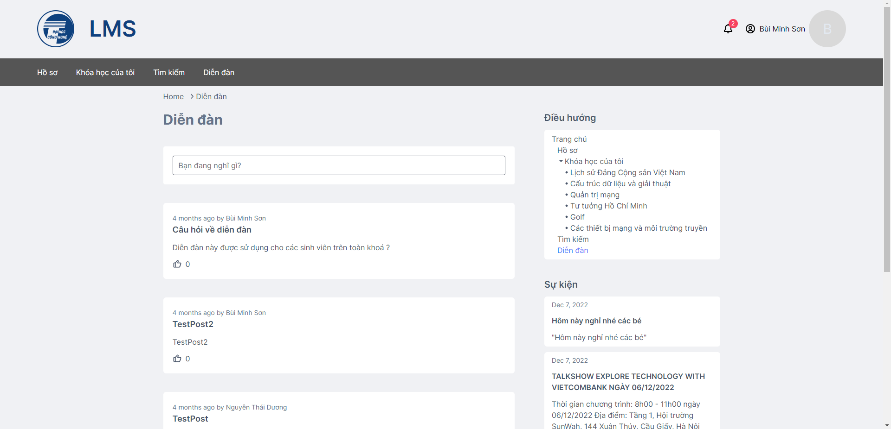
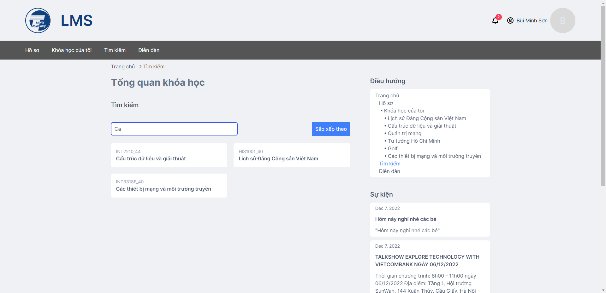

# Báo cáo bài tập lớn nhóm 2 - Learning Management System

---

## Thành viên

- Nguyễn Tuấn Nam - frontend, backend, deploy
- Đỗ Anh Tú - frontend
- Đỗ Minh Quân - frontend
- Nông Ngọc Sơn - frontend
- Nguyễn Phú Đức - frontend
- Bùi Minh Sơn - backend
- Phan Duy Thắng - backend

## Đề tài nhóm

**Tên sản phẩm:** _Learning Management System_

**Đối tượng hướng đến:** _Sản phảm hướng tới các giáo viên và sinh viên sử dụng để quản lý học trực tuyến_

**Chức năng chính của sản phẩm:**

- Giáo viên có thể tạo các khóa học, thêm sinh viên vào lớp, tạo tài khoản cho sinh viên và upload các học liệu
- Sinh viên có thể vào các khóa học để xem các học liệu giáo viên up lên, giao lưu với các sinh viên các trên forum

## Công nghệ sử dụng

### Frontend

- React
- React Router
- Axios
- Tailwind CSS

### Backend

- Django
- Django Rest Framework
- Django Rest Framework JWT
- Whitenoise
- Waitress
- CSDL MySQL

### Kiến trúc tổng quan

## Hướng dẫn cài đặt và sử dụng sản phẩm đối với môi trường development

- Clone mã nguồn về
- Tạo database với tên w42g2_lms trong MySQL và import data từ file Dump20221212.sql
- Mở 2 terminal, 1 terminal `cd` tới thư mục frontend, 1 terminal `cd` thư mục backend
- Trong terminal backend
  - Tạo và khởi động một virtual environment
  - Chạy lệnh `pip install -r requirements.txt`
  - Chạy lệnh `python manage.py migrate`
  - Chạy lệnh `python manage.py runserver`
- Trong terminal frontend
  - Chạy lệnh `npm install`
  - Chạy lệnh `npm start`
- Gõ [localhost:3000](localhost:3000) trong browser để được đưa tới trang web sản phẩm

## Hướng dẫn build cho môi trường production

- Clone mã nguồn về
- Tạo database với tên w42g2_lms trong MySQL và import data từ file Dump20221212.sql
- Mở 2 terminal, 1 terminal `cd` tới thư mục frontend, 1 terminal `cd` thư mục backend
- Trong terminal frontend
  - Chạy lệnh `npm install`
  - Chạy lệnh `npm run build`
- Trong terminal backend
  - Tạo và khởi động một virtual environment
  - Chạy lệnh `pip install -r requirements.txt`
  - Chạy lệnh `python manage.py migrate`
  - Chạy lệnh `python manage.py collectstatic`
  - Chạy lệnh `expose 8080`
  - Chạy lệnh `waitress-serve --host <địa chỉ ip khi chạy lệnh expose> lms.wsgi:application`
- Gõ [w42g2.int3306.freeddns.org](http://w42g2.int3306.freeddns.org/login) trong browser để được đưa tới trang web sản phẩm

## Tài khoản mẫu

- Giảng viên
  - Tên đăng nhập: admin
  - Mật khẩu: admin
- Sinh viên
  - Tên đăng nhập: 20021427
  - Mật khẩu: 20021427aa

## Một số hình ảnh mô tả

